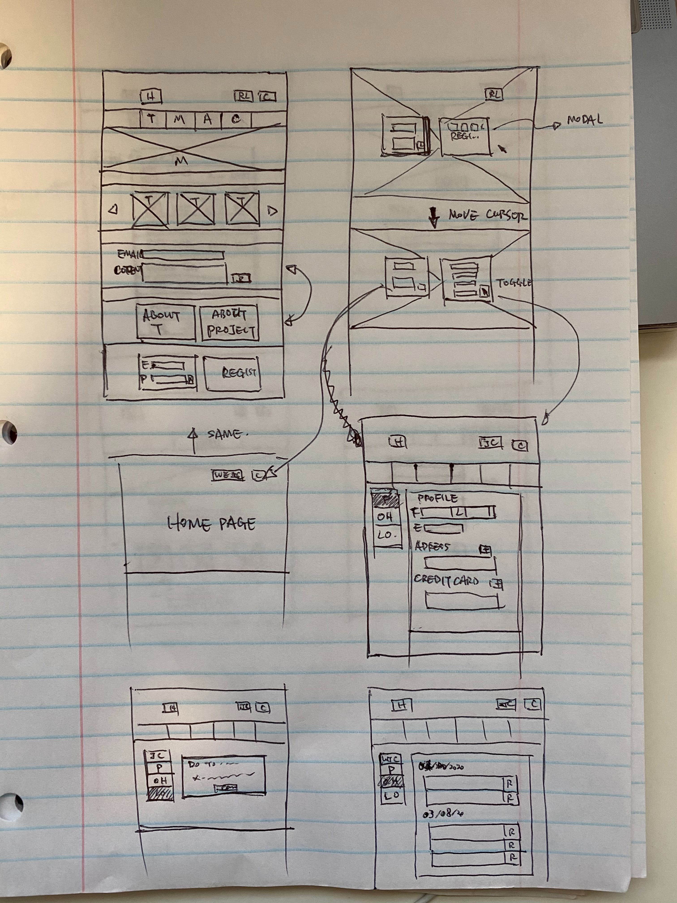
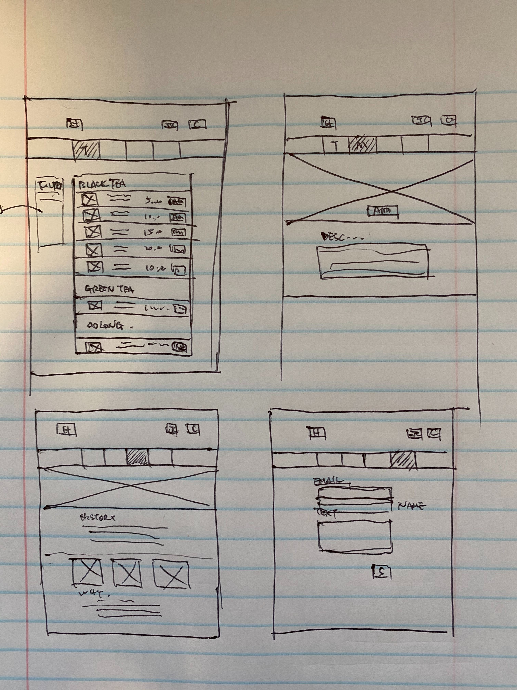
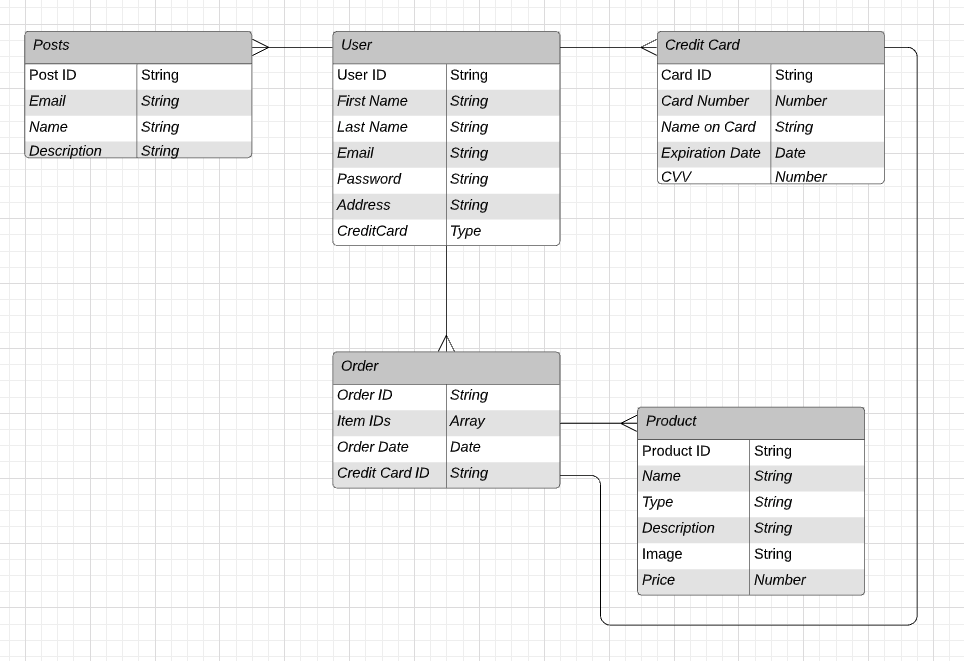

# Mi-TEA

It's the website for displaying and selling Mi-TEA machine and tea ingredients, as well as demonstrating Mi-TEA culture.

## Index

* [User Stories](#User-Stories)
* [User Flow](#User-Flow)
* [Site Map](#Site-Map)
* [Wireframes](#Wireframes)
* [Data Models](#Data-Models)
* [Technologies](#Technologies)
* [Stretch Goals](#Stretch-Goals)
* [License](#License)

## User Stories

#### Before logged in

Site visitors will be able to view the home page, teas page, machine page and about page.

Navbar should be always display on the top, above navbar, there should be two buttons: sign up and my bag(0)

On the home page, images are displayed, click the images will be redirect to new pages

When user clicks on Teas link they will be direct to a new page which has:
* list of teas and teas ingredients
	* for each list, display the image, name, description, price, add to bag button
	* click on each list item, there will be modal displaying the detail with a add to bag button
	* after clicking the add to bag button the item number will be increased

When user clicks on Machine link they will be direct to a new page which has:
* hero shot of the product
* Add to bag button
	* after clicking the add to bag button the item number will be increased
* horizontal scroll menu displays the recommended teas
	* each card in the menu has image, name, price and add to cart button

When user clicks on About link they will be direct to a new page which has:
* Description of teas
* About the website idea and design process

When user clicks on Contact link they will be direct to a new page which has:
* Email Bar
* Name Bar
* Comments
* Send button
* When they click on the send button, there should be an email sent to the admin email address

#### Register and Login

Register page will ask people to input:
* First name
* Last name
* Email address
* Password

After clicked sign up, the user will be guided to profile page to add an address and a credit card info. This can be skipped but can't get through if the user wants to check out

Logged in page will ask people to input:
* Email address
* Password

After Signed up, the user will be guided to a home page with a congrates bar

#### After Logged in

The signup/login button will disappear on main page and there is a button called WELCOME xxx shows up.

After click the new profile button will guide into profile page, with side bar

Side bar has:
* User name
* Buttons:
	* Profile
	* Order History
	* Log out

Profile Page contains:
* First name
* Last name
* email
* address
* phone

Order history Page contains:
* List of Orders Sort By date:
	* Name
	* Image

## User Flow

See user flow on [gloomaps](https://www.gloomaps.com/wgvkaMos6a)

## Site Map

## Wireframes

## ERD

See diagram on [lucidchart](https://www.lucidchart.com/invitations/accept/44d72878-61fc-4aa8-b688-39cc548fcfd6)

## Technologies

React | JavaScript | MongoDB | Mongoose | Express | Bootstrap | Node.js

## Stretch goals

* sort and filter teas by: 
	* type
	* price
	
* drag and drop teas into shopping cart:
	
* send email to server

* forget password and send password to email

* change password from profile page

* reorder

## Sprint 1 (May/1 - May/3)
May/1: Finish User Flow, start with backend
May/2: Finish Half of back end, set up server, models, most of routes and basic seed files
May/3: Finish backend, testing

## Sprint 2 (May/4 - May/6)
May/4: Start frontend, set up all routes, components, and relations, all the pages should be able to connect
May/5: have register and login work, all the pages look  like final design
May/6: able to make orders, without having credit card info, able to review order history after log in

## Sprint 3 (May/7 - May/8)
May/7: Add more data to seed file and authorize credit card, have to select a card and address to finish the order
May/8: Fully functional website done

## Sprint 4 (May/9 - May/10)
May/9: work on styling with bootstrap, css and sass, heroku deploying
May/10: Extra day to fix bugs and work on stretch goals if there is extra time

## License
[MIT](https://choosealicense.com/licenses/mit/)

---
[back to the top](#Kidsbook)
# Mi-TEA

It's the website for displaying and selling Mi-TEA machine and tea ingredients, as well as demonstrating Mi-TEA culture.

## Index

* [User Stories](#User-Stories)
* [User Flow](#User-Flow)
* [Site Map](#Site-Map)
* [Wireframes](#Wireframes)
* [Data Models](#Data-Models)
* [Technologies](#Technologies)
* [Stretch Goals](#Stretch-Goals)
* [License](#License)

## User Stories

#### Before logged in

Site visitors will be able to view the home page, teas page, machine page and about page.

Navbar should be always display on the top, above navbar, there should be two buttons: sign up and my bag(0)

On the home page, images are displayed, click the images will be redirect to new pages

When user clicks on Teas link they will be direct to a new page which has:
* list of teas and teas ingredients
	* for each list, display the image, name, description, price, add to bag button
	* click on each list item, there will be modal displaying the detail with a add to bag button
	* after clicking the add to bag button the item number will be increased

When user clicks on Machine link they will be direct to a new page which has:
* hero shot of the product
* Add to bag button
	* after clicking the add to bag button the item number will be increased
* horizontal scroll menu displays the recommended teas
	* each card in the menu has image, name, price and add to cart button

When user clicks on About link they will be direct to a new page which has:
* Description of teas
* About the website idea and design process

When user clicks on Contact link they will be direct to a new page which has:
* Email Bar
* Name Bar
* Comments
* Send button
* When they click on the send button, there should be an email sent to the admin email address

#### Register and Login

Register page will ask people to input:
* First name
* Last name
* Email address
* Password

After clicked sign up, the user will be guided to profile page to add an address and a credit card info. This can be skipped but can't get through if the user wants to check out

Logged in page will ask people to input:
* Email address
* Password

After Signed up, the user will be guided to a home page with a congrates bar

#### After Logged in

The signup/login button will disappear on main page and there is a button called WELCOME xxx shows up.

After click the new profile button will guide into profile page, with side bar

Side bar has:
* User name
* Buttons:
	* Profile
	* Order History
	* Log out

Profile Page contains:
* First name
* Last name
* email
* address
* phone

Order history Page contains:
* List of Orders Sort By date:
	* Name
	* Image

## User Flow

See user flow on [gloomaps](https://www.gloomaps.com/wgvkaMos6a)

## Site Map

## Wireframes

## Data Models

See diagram on [lucidchart](https://www.lucidchart.com/invitations/accept/44d72878-61fc-4aa8-b688-39cc548fcfd6)

## Technologies

React | JavaScript | MongoDB | Mongoose | Express | Bootstrap | Node.js

## Stretch goals

* sort and filter teas by: 
	* type
	* price
	
* drag and drop teas into shopping cart:
	
* send email to server

* forget password and send password to email

* change password from profile page

* reorder

## Sprint 1 (May/1 - May/3)
May/1: Finish User Flow, start with backend
May/2: Finish Half of back end, set up server, models, most of routes and basic seed files
May/3: Finish backend, testing

## Sprint 2 (May/4 - May/6)
May/4: Start frontend, set up all routes, components, and relations, all the pages should be able to connect
May/5: have register and login work, all the pages look  like final design
May/6: able to make orders, without having credit card info, able to review order history after log in

## Sprint 3 (May/7 - May/8)
May/7: Add more data to seed file and authorize credit card, have to select a card and address to finish the order
May/8: Fully functional website done

## Sprint 4 (May/9 - May/10)
May/9: work on styling with bootstrap, css and sass, heroku deploying
May/10: Extra day to fix bugs and work on stretch goals if there is extra time

## License
[MIT](https://choosealicense.com/licenses/mit/)

---
[back to the top](#Kidsbook)
